This page renders every Mermaid diagram (`.mmd`) currently committed in the monorepo, using Mintlify's built-in client-side Mermaid rendering — no build step, no generated PNGs, no extra CI. Each diagram below is interactive: you can pan and zoom directly in the browser.

<Note>
  These fenced blocks are copies of the authoritative `.mmd` files. If a diagram changes, update its source file under `docs/` and refresh the matching block here in the same PR.
</Note>

## Dependency Phases

How proposal/registry items move through dependency phases. Source: [`docs/agentic/dependency-phases.mmd`](https://github.com/timerloggedout-spec/termux-monorepo/blob/master/docs/agentic/dependency-phases.mmd)

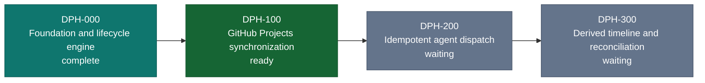

## Model Routing (3-Lane)

Provider routing across the three operational lanes. Source: [`docs/ops/diagrams/model-routing-3l0.mmd`](https://github.com/timerloggedout-spec/termux-monorepo/blob/master/docs/ops/diagrams/model-routing-3l0.mmd)

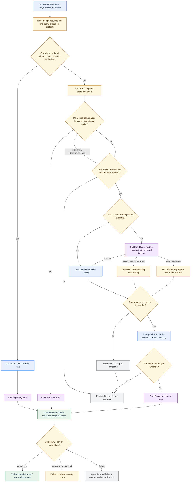

## Timing & Resilience

Retry, backoff, and resilience timing model for automation. Source: [`docs/ops/diagrams/timing-resilience.mmd`](https://github.com/timerloggedout-spec/termux-monorepo/blob/master/docs/ops/diagrams/timing-resilience.mmd)

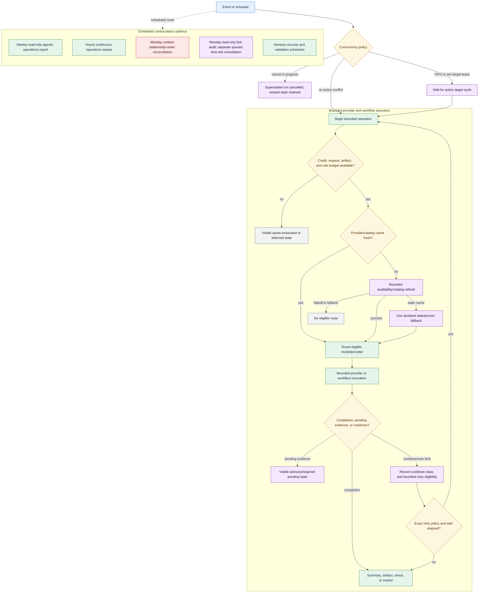

## Automation Overview

High-level map of the automation surface. Source: [`docs/ops/diagrams/automation-overview.mmd`](https://github.com/timerloggedout-spec/termux-monorepo/blob/master/docs/ops/diagrams/automation-overview.mmd)

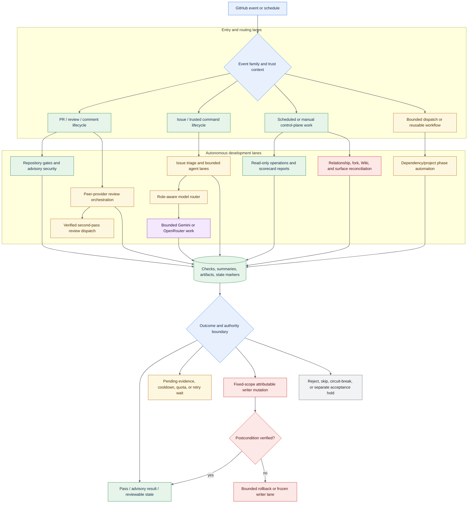

## Self-Healing Engine

Architecture of the self-healing remediation engine. Source: [`docs/architecture/SELF-HEALING-ENGINE.mmd`](https://github.com/timerloggedout-spec/termux-monorepo/blob/master/docs/architecture/SELF-HEALING-ENGINE.mmd)

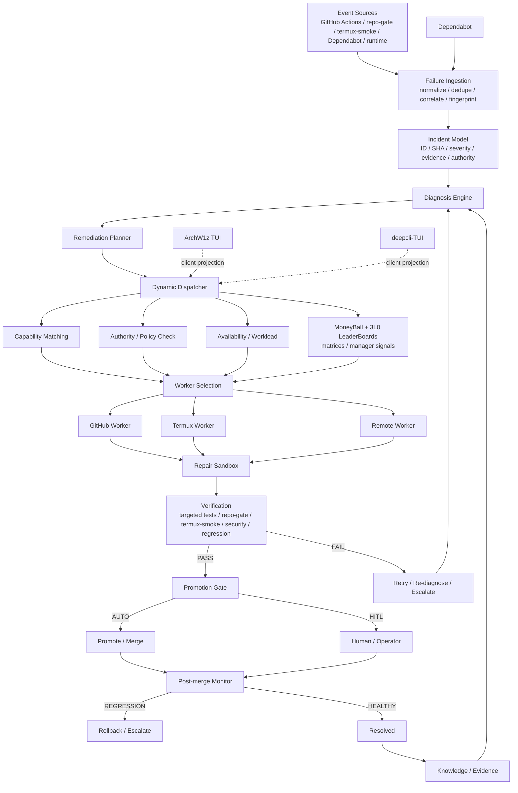

## Peer Provider Review

Peer review flow between provider agents. Source: [`docs/ops/diagrams/peer-provider-review.mmd`](https://github.com/timerloggedout-spec/termux-monorepo/blob/master/docs/ops/diagrams/peer-provider-review.mmd)

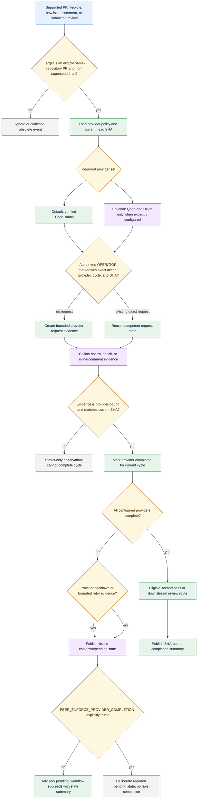

## Issue/PR Decision Tree

Decision tree agents follow when triaging an issue or PR. Source: [`docs/ops/diagrams/issue-pr-decision-tree.mmd`](https://github.com/timerloggedout-spec/termux-monorepo/blob/master/docs/ops/diagrams/issue-pr-decision-tree.mmd)

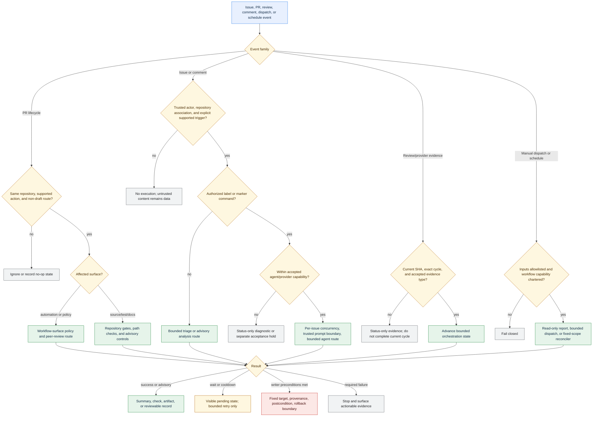

## Role & Authority Hierarchy

Who holds authority over which class of decision. Source: [`docs/ops/diagrams/role-authority-hierarchy.mmd`](https://github.com/timerloggedout-spec/termux-monorepo/blob/master/docs/ops/diagrams/role-authority-hierarchy.mmd)

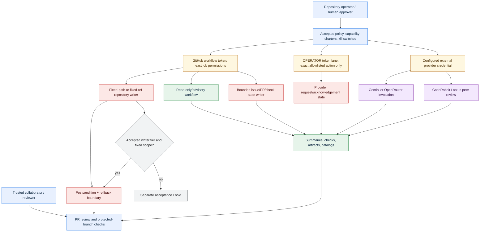

## Agent Team Control Plane

Control-plane architecture coordinating the multi-agent team. Source: [`docs/architecture/AGENT-TEAM-CONTROL-PLANE.mmd`](https://github.com/timerloggedout-spec/termux-monorepo/blob/master/docs/architecture/AGENT-TEAM-CONTROL-PLANE.mmd)

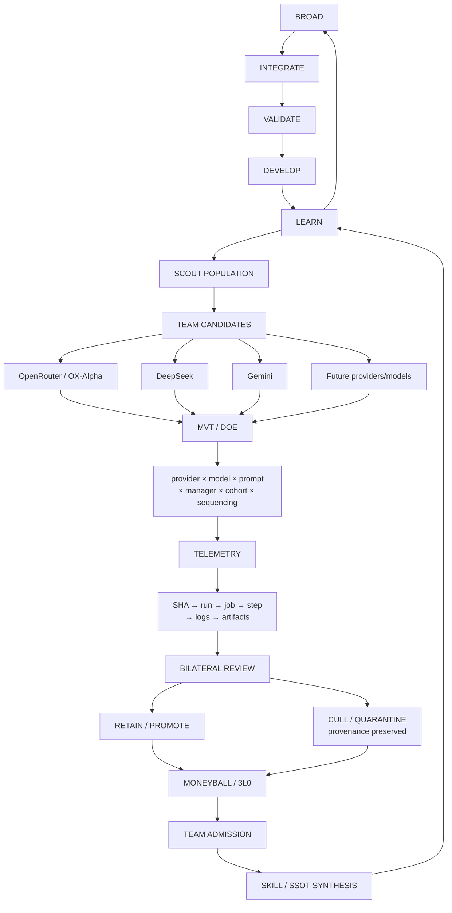

# Agent Team Control Plane — BIUDL

This chart is the canonical compact orientation view of the evolving agent-team development loop. It complements, rather than replaces, detailed SSOTs, workflows, skills, experiments, and historical decision records.

## BIUDL

**BIUDL = Broad → Integrate → Validate → Develop → Learn.**

The loop is intentionally cyclic: learning changes the next broad baseline. A thin validated slice is therefore an intermediate state, not the final destination.

## Evidence contract

A node transition is not proof of success. HTTP success, workflow success, review acknowledgement, low latency, or response size are observations. Task outcome remains separately classified (`PASS`, `FAIL`, `UNKNOWN`, or another documented state).

Correctness has priority over latency. Resource/quota state is a capacity signal, not a quality score.

## Control-plane roles

Scout discovers candidates and proposes missions; it does not grant routing authority. Managers/MoneyBall/3L0 make promotion decisions from attributable evidence. Experiment lanes apply DOE/MVT designs. Telemetry establishes SHA-to-runtime lineage. Bilateral review challenges both implementation and conclusions. Synthesis feeds verified learning into skills and SSOTs.

## Dynamic population

OX-Alpha, DeepSeek, Gemini, and future providers/models are selectable population members rather than permanent hardcoded winners. Discovery, availability, pricing, quota, capability, and runtime evidence should be observed dynamically.

## Culling

Culling is a state transition, not deletion. Preserve identity, attempts, scores, contributions, reviews, and provenance. Future wallet/reward/community-pot accounting must consume this contribution history without changing the performance evidence.

## Research and oversight

Scout missions may propose provider research, code reconnaissance, performance tests, regression investigations, and oversight/security evaluation cohorts such as Bug Bounty, Help Wanted, CTF, developer-skill, and security-skill tasks. These are evidence-producing evaluation populations, not automatic trust grants.

## Runtime evidence lineage

`SHA → workflow run → job → step → logs/artifacts → outcome → review → promotion decision`.

## Related systems

- `.agents/skills/evidence-led-monorepo-ops/SKILL.md`
- `.agents/skills/review-loop/SKILL.md`
- `.agents/skills/adaptive-feedback-cycle/SKILL.md`
- `.agents/skills/context-relationship-graph/SKILL.md`
- `.agents/skills/gemini-performance-psychology/SKILL.md`
- `.agents/skills/multivariate-doe/SKILL.md`
- `docs/ops/AGENT-TEAM-DEVELOPMENT-LANES.md`
- `docs/ops/SCOUT-MISSIONS.md`
- `docs/ops/SCOUT-ROSTER.md`
- `docs/ops/ACTIONS-METRICS-INTEGRATION.md`
- `docs/architecture/AGENT-TEAM-CONTROL-PLANE.mmd`
- `docs/architecture/SELF-HEALING-ENGINE-ROADMAP.md`
```

## Leaderboard Data Lineage

Data lineage feeding the agent leaderboard. Source: [`docs/ops/diagrams/leaderboard-data-lineage.mmd`](https://github.com/timerloggedout-spec/termux-monorepo/blob/master/docs/ops/diagrams/leaderboard-data-lineage.mmd)

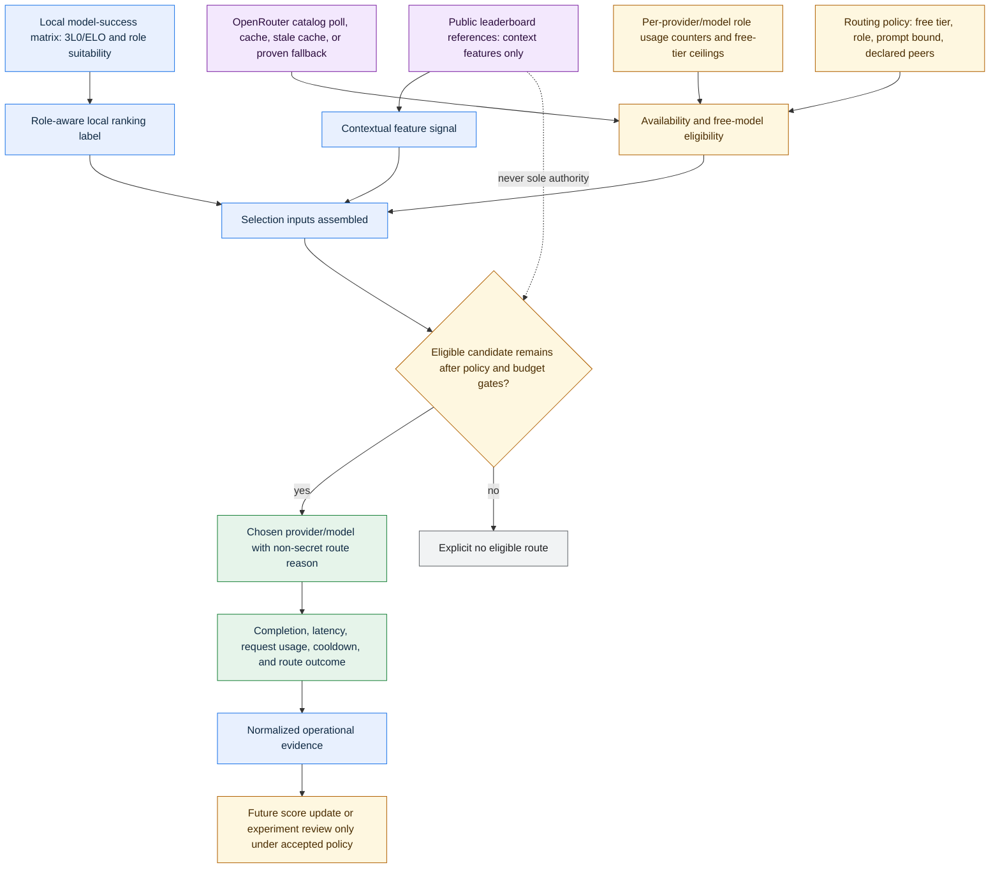

## Autonomous Writer Rollback

Rollback path for autonomous-writer changes. Source: [`docs/ops/diagrams/autonomous-writer-rollback.mmd`](https://github.com/timerloggedout-spec/termux-monorepo/blob/master/docs/ops/diagrams/autonomous-writer-rollback.mmd)

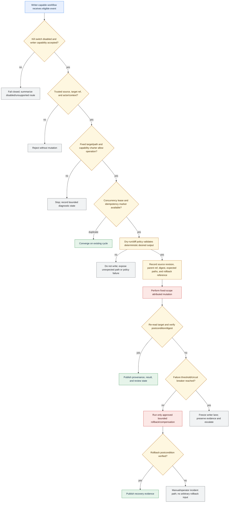

## Agent Selection (Blind Evaluation)

Blind-evaluation flow for selecting between candidate agents. Source: [`docs/architecture/AGENT-SELECTION-BLIND-EVALUATION.mmd`](https://github.com/timerloggedout-spec/termux-monorepo/blob/master/docs/architecture/AGENT-SELECTION-BLIND-EVALUATION.mmd)

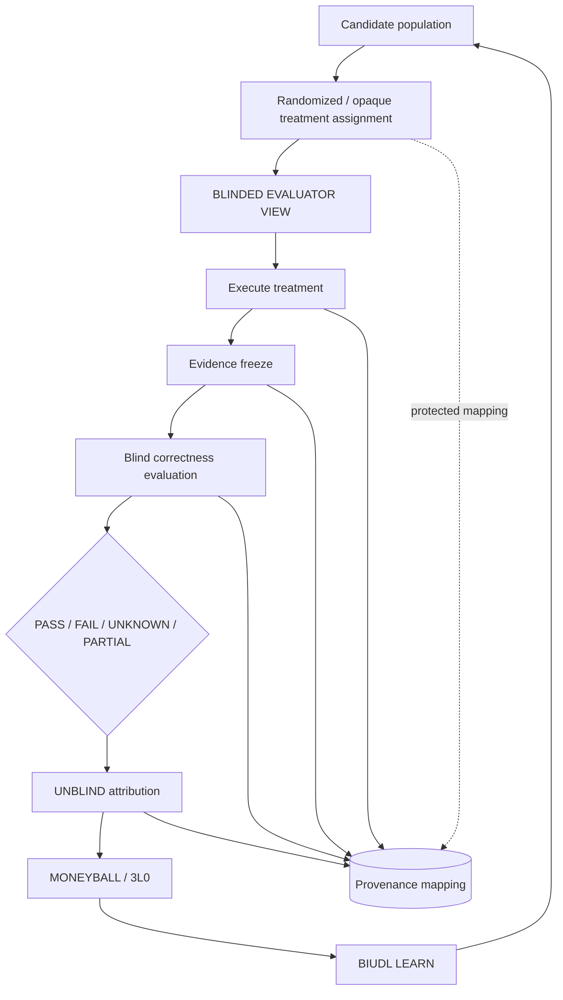

# Blind Agent Selection — Evaluation Boundary

This diagram shows the evaluation boundary: identity is hidden where feasible, but provenance remains reconstructable. Unblinding occurs after evidence is frozen unless a documented safety, debugging, quota, or operational exception requires earlier access.
```

