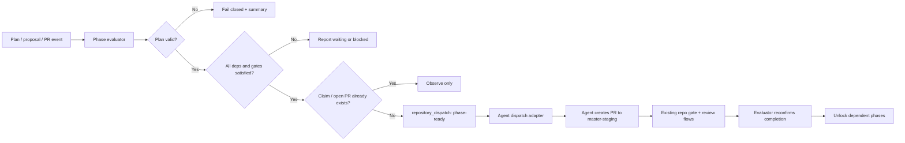

# Gantt Dependency Phases and GitHub Actions–First Agentic Flow Design

**Author:** Manus AI
**Status:** Design recommendation; no repository changes, commits, workflow dispatches, or external writes were performed.
**Scope:** `timerloggedout-spec/termux-monorepo`, with `GanTTY_fork` and `gantt-cli_fork_agentic` assessed as possible customized reference inputs.

## Executive position

The monorepo should introduce a **repository-native, declarative dependency-phase plan** as the authoritative state, and use GitHub Actions as a deterministic evaluator and dispatcher. Gantt views should be generated from that plan; they should not be the source of truth. This preserves the repository’s existing proposal lifecycle, which already distinguishes `accepted`, `executing`, `blocked`, and `closed`, and keeps agent execution constrained by `master-staging`, required gates, and human-only steps.[1]

The Rust `gantt-cli_fork_agentic` is the stronger long-term visualization/export candidate because it persists JSON, models `dependencies` and `parent_id`, computes dates, and identifies unschedulable circular dependencies.[2] However, it renumbers task IDs when items are reordered, which makes it unsafe as a canonical cross-workflow identity store. `GanTTY_fork` is useful as an interaction reference but is unsuitable for automation as it is an interactive Python TUI with binary pickle persistence.[3]

> **Design rule:** Stable phase identities belong in version-controlled YAML. The Gantt representation is a derived view, never the authority that decides whether an agent may start work.

| Decision area | Recommended design | Rationale |
|---|---|---|
| Canonical plan | `docs/agentic/dependency-phases.yaml` | Reviewable, diffable, mergeable, and independent of UI task renumbering. |
| Dependency unit | Stable string `phase_id` plus a list of prerequisite phase IDs | Supports fan-in, validation, and unambiguous audit trails. |
| State authority | Derived by a deterministic evaluator from plan, issue/PR evidence, and checks | Prevents an LLM or a Gantt UI from authorizing work. |
| Agent launch | Dedicated GitHub Actions dispatcher invoked only for ready phases | Reuses the project’s Jules coordination patterns without treating labels as control-plane authority.[4] |
| Gantt tooling | Optional generated JSON / image export | Keeps visualization useful without coupling orchestration to a terminal UI. |
| Fork integration | Shallow, pinned customization submodules only after an adapter is justified | Matches the monorepo’s existing fork and Gitlink policy.[5] |

## Existing foundations and implications

The repository already has the required control-plane pieces. The proposal process requires agents to start from `registry.yaml`, branch from `master-staging`, cite item IDs, and pass `repo-gate` and `termux-smoke` before closing work.[1] The lightweight `repo-gate` intentionally avoids device-heavy build assumptions and keeps submodules uninitialized in CI, so phase evaluation must likewise operate on small repository-native metadata rather than requiring a Gantt UI build or full submodule checkout.[6]

The existing issue-to-Jules workflow establishes an appropriate execution boundary: it inventories related open agent pull requests, supplies a structured prompt, tells the agent to avoid overlapping files, and targets `master-staging`.[4] A phase system should call the same launch capability only after its prerequisites and gates evaluate as satisfied. It should not depend on a `jules` label being added as the only launch signal.

| Reviewed component | Observed capability | Automation suitability | Role in the proposed system |
|---|---|---|---|
| Proposal process | Repository-native lifecycle, item IDs, gate coupling, explicit `blocked` state | High | Canonical governance and completion semantics. |
| `agent-jules-on-issues.yml` | Issue-based agent launch, PR inventory, claims, `master-staging` prompt | High | Template / reusable launch adapter. |
| `agent-continuous-ops.yml` | Scheduled reconciliation, bounded processing, explicit concurrency | High | Pattern for a limited reconciliation sweep, not phase-state authority.[7] |
| `gantt-cli_fork_agentic` | JSON persistence, parent tasks, dependency edges, computed dates, cycle warning | Medium | Derived Gantt renderer/exporter after a stable-ID adapter exists. |
| `GanTTY_fork` | Visual dependency selection and critical-path-style task states | Low | UI/reference inspiration only; do not make it a CI runtime dependency. |
| Named `gantless_fork-agentic` | The supplied owner/name could not be resolved during review | Unknown | Confirm the canonical repository URL before it is added to a plan or `.gitmodules`. |

## Canonical dependency model

The first implementation should store only policy and durable identifiers in a small YAML file. Task dates and rendering preferences are intentionally omitted from the authority model. The evaluator will compute a phase’s eligibility from its dependencies, its governing proposal item state, the required checks, and any human approval flag.

```yaml
# docs/agentic/dependency-phases.yaml
schema_version: 1
plan_id: gantt-dependency-phases
base_branch: master-staging

phases:
  - phase_id: DPH-00
    title: Model and validator foundation
    proposal: gantt-dependency-phases
    items: [DPH-00-01]
    depends_on: []
    required_gates: [repo-gate, termux-smoke]
    execution:
      mode: human_or_agent
      agent: jules
    completion:
      require_merged_pr: true
      require_all_items_terminal: true

  - phase_id: DPH-10
    title: Deterministic phase evaluator
    proposal: gantt-dependency-phases
    items: [DPH-10-01, DPH-10-02]
    depends_on: [DPH-00]
    required_gates: [repo-gate, termux-smoke]
    execution:
      mode: agent
      agent: jules
    completion:
      require_merged_pr: true
      require_all_items_terminal: true

  - phase_id: DPH-20
    title: Controlled agent dispatch integration
    proposal: gantt-dependency-phases
    items: [DPH-20-01]
    depends_on: [DPH-10]
    required_gates: [repo-gate, termux-smoke]
    approval:
      required: true
      approved_by: []
    execution:
      mode: agent
      agent: jules
    completion:
      require_merged_pr: true
      require_all_items_terminal: true

  - phase_id: DPH-30
    title: Derived Gantt export and fork adapter
    proposal: gantt-dependency-phases
    items: [DPH-30-01]
    depends_on: [DPH-20]
    required_gates: [repo-gate, termux-smoke]
    execution:
      mode: agent
      agent: jules
    completion:
      require_merged_pr: true
      require_all_items_terminal: true
```

A validator should reject duplicate phase IDs, unknown dependencies, self-dependencies, dependency cycles, unsupported gates, duplicate item ownership unless explicitly allowed, and `approval.required: true` phases with no future approval mechanism. It should produce a topological order and a machine-readable evaluation report. The first release must **not** write computed state back into the plan; doing so would create event loops and make a reviewable plan reflect transient workflow timing.

| Derived phase state | Deterministic condition | Permitted automation response |
|---|---|---|
| `waiting` | At least one prerequisite is incomplete | Report only. No agent launch. |
| `blocked` | A prerequisite is explicitly blocked or a required human approval is absent | Report the blocking evidence. No agent launch. |
| `ready` | All prerequisites complete, gates satisfied, phase has not been claimed | Create exactly one dispatch request. |
| `running` | A valid claim or open phase-linked PR exists | Monitor only; do not launch a duplicate agent. |
| `awaiting_review` | A phase-linked PR exists but has unresolved threads or failed required checks | Hand off to the existing review/ops mechanisms. |
| `complete` | Required merged PR and terminal items are evidenced | Unlock dependents; do not auto-close a proposal without the repository’s required record. |
| `invalid` | Validation, cycle, identity, or evidence conflict exists | Fail closed and surface a concise diagnostic. |

## GitHub Actions control flow

The proposed control flow separates **evaluation**, **agent launch**, and **status observation**. Each is deterministic except the work performed by the downstream agent. This separation prevents a model-generated comment or a label change from becoming an implicit authorization to modify the repository.



### Workflow set

| Workflow / component | Triggers | Minimal responsibility | Token scope |
|---|---|---|---|
| `phase-plan-validate.yml` | Pull requests affecting phase metadata; `workflow_dispatch` | Validate schema, DAG, item uniqueness, and fixtures. | `contents: read` |
| `phase-evaluate.yml` | Trusted `push` to `master-staging`, `repository_dispatch`, manual dispatch, and a bounded reconciliation schedule | Build evidence, derive status, publish a step summary, and issue a single phase-ready dispatch per idempotency key. | `contents: read`, `checks: read`, `pull-requests: read`, `issues: read` plus `issues: write` only if a status comment is retained. |
| `phase-agent-dispatch.yml` | `repository_dispatch` event type `phase-ready`; manual dispatch for recovery | Revalidate eligibility, record a claim, and invoke the existing agent adapter. | `contents: read`, `issues: write`, `pull-requests: read` |
| `phase-status-report.yml` | Manual dispatch and low-frequency schedule | Write a human-readable phase matrix and stalled-work summary. | `contents: read`, `pull-requests: read`, `issues: read`, `checks: read` |
| `scripts/agentic/validate_dependency_phases.py` | Called by the validation/evaluation workflows | Pure parse, validate, topology, and report functions; no GitHub writes. | No token |

The evaluator should be serialized per plan, using a concurrency key such as `dependency-phases-${{ github.repository }}-${{ inputs.plan_id || 'default' }}` with `cancel-in-progress: false`. The current GitHub Actions concurrency model otherwise allows only one pending run by default; retaining queued evaluations is preferable because each event can carry distinct completion evidence.[8] Where the platform’s `queue: max` setting is available, it should be used for the evaluator; every run must still be idempotent.

> **Important trigger rule:** A label or comment created with `GITHUB_TOKEN` will not ordinarily start another workflow. GitHub explicitly exempts `workflow_dispatch` and `repository_dispatch`, so the evaluator should use an explicit dispatch event rather than rely on a bot-applied `jules` label to chain workflows.[9]

## Agent launch contract

A `phase-ready` payload should include the stable phase ID, the plan hash, the triggering SHA, governing proposal ID, item IDs, expected base branch, and an idempotency key. The dispatcher must independently reread the plan and re-evaluate eligibility; it must never trust only the event payload.

The agent prompt should retain the repository’s established coordination constraints: inspect `AGENTS.md`, start from `master-staging`, avoid files claimed by open agent PRs, cite the phase/item IDs, and leave structured claim metadata. The plan evaluator should regard the claim as an observation, not proof of completion. A merged PR plus the required gates and terminal work items remain the completion proof.[1] [4]

| Dispatch safeguard | Required behavior |
|---|---|
| Claim key | `phase_id + plan_content_hash + target_branch`; a repeat event with the same key is a no-op. |
| Branch boundary | Agent work targets `master-staging`; no automation merges into `master`. |
| File overlap | Reuse the existing open-PR inventory and claim marker; flag ambiguous ownership rather than dispatching a second agent. |
| Approval boundary | `approval.required` phases may be reported as ready-for-approval but not dispatched. |
| Failed agent attempt | Mark as observed failure/stall in the report; require explicit retry via manual dispatch or a newly versioned plan change. |
| Completion | Require objective evidence. A completion comment alone never unlocks a dependent phase. |

## Security and governance boundaries

The design should use `pull_request` for validation of untrusted changes and trusted `push`/explicit dispatch for any operation that can write comments or launch an agent. It should not add a privileged `pull_request_target` flow just to simplify PR data access. GitHub cautions that privileged triggers combined with untrusted checkout can compromise the repository, and recommends least-privilege workflow tokens and full-SHA action pinning.[10] The existing repository’s use of an empty root permission set and job-specific permissions provides a good precedent.[7]

No phase workflow should merge PRs, change proposal status automatically, close issues, rotate credentials, or make submodule updates. A phase can only declare that its evidence is complete. The existing proposal process retains final lifecycle authority, including the requirement for a review record and a move to `closed/`.[1]

| Boundary | Enforcement |
|---|---|
| Workflow source | Protect `.github/workflows/**`, phase schema, and validator via review ownership. |
| Untrusted contribution | Validate only; no write token, secret, or privileged checkout. |
| Agent identity | Require agent identity and task/phase reference in commits and PR claims. |
| Human-only work | Model explicitly with `approval.required`; evaluator fails closed until approval evidence is present. |
| Submodule update | Separate PR in the fork first, then a small Gitlink-advance PR with `git diff --submodule=log` and standard gates.[5] |
| Plan integrity | Treat a plan hash as part of every dispatch and claim; altered plan equals a new execution decision. |

## Fork and submodule strategy

The current monorepo policy is precise: reference forks are shallow, pinned customization surfaces, not automatic runtime dependencies.[5] The same policy should govern any Gantt integration. Therefore, the initial two workflow PRs should have **no Gantt submodule requirement**. They should use the YAML plan and Python validator only.

After the phase model is stable, the `gantt-cli_fork_agentic` fork can justify a shallow submodule under `refTemplates/smods/gantt-cli_fork_agentic` only if the fork first gains a non-interactive, stable-ID adapter. The adapter should read the YAML plan, preserve string phase IDs in an explicit field, validate the DAG without a TUI, and emit derived JSON or Markdown. It must not depend on the fork’s current positional numeric IDs because reordering remaps them and their dependency lists.[2]

`GanTTY_fork` should not be introduced as a submodule for CI orchestration. Its terminal interaction model and pickle-backed state mean it does not provide a suitable deterministic artifact or reviewable storage format. It may remain a visual/reference inspiration for a future local Termux interface.[3]

## Phased delivery sequence

The following delivery path creates a usable control plane early and limits risk. Each phase should be a separate PR against `master-staging`, using the project’s existing gates and agent coordination convention.

| Delivery PR | Scope | Explicitly excluded | Acceptance evidence |
|---|---|---|---|
| **PR 1 — Model and validation** | YAML schema, pure validator, fixtures, documentation, `phase-plan-validate.yml` | Agent dispatch, comments, submodules, UI | Valid fan-in plan passes; cycle, unknown phase, duplicate item ownership, and invalid gate fixtures fail. |
| **PR 2 — Read-only evaluator** | Evidence collector, phase-state report, manual dispatch, trusted-branch invocation | Auto-launch and repo state writes | A fixture/replay produces the expected `waiting`, `blocked`, `ready`, and `complete` matrix. |
| **PR 3 — Controlled dispatch** | `repository_dispatch` contract, idempotent claim, reuse/refactor of the Jules launch adapter | Automatic merge, automatic proposal promotion | Exactly one agent invocation for a ready phase; duplicate events do not re-invoke; approval-gated phase is not launched. |
| **PR 4 — Reconciliation and status** | Bounded scheduled report/evaluation, stale claim diagnostics, manual recovery runbook | High-frequency polling and silent retries | Reconciliation detects an event gap without duplicate launch; report links plan, issue, PR, checks, and action run. |
| **PR 5 — Derived Gantt output** | Stable-ID exporter and, only if proven useful, pinned fork adapter/submodule | Making a terminal TUI the authority | Same YAML source creates repeatable Gantt JSON/Markdown; no plan mutation by renderer. |

## Viable implementation paths

The stated preference for GitHub Actions is a good match for an initial, repository-contained control plane. A second path remains viable if the system later needs high-frequency coordination across many repositories or agents; choosing it now would add operational surface before the plan semantics are proven.

| Approach | Tradeoffs | Cost | Setup complexity |
|---|---|---|---|
| **A. Repository-contained GitHub Actions control plane** | Uses versioned plan, explicit events, and existing agent workflows; runs are bounded and auditable. Scheduling is suitable for reconciliation, not real-time orchestration. | Uses the repository’s Actions allowance; no additional always-on host. | Moderate; begin with validator and read-only evaluator. |
| **B. Continuously hosted coordination service** | Can maintain durable queues, richer cross-repo state, and prompt real-time handling; adds hosting, credential, backup, and attack-surface responsibilities. | Ongoing hosting/operations cost. | High; defer until Actions-based semantics demonstrably need it. |

## Immediate next decision

No mutation is required to proceed. The narrow next step is approval of **PR 1: Model and validation**. It establishes the dependency vocabulary, prevents cycles and ambiguous item ownership, and lets the team inspect a generated readiness report before any agent can be launched automatically.

Before implementation, confirm the exact repository URL for the named `gantless_fork-agentic` project and whether its intended role is **visualization**, **CLI validation**, or another submodule customization surface. Until then, it should remain out of `.gitmodules` and out of the phase execution path.

## References

[1]: https://github.com/timerloggedout-spec/termux-monorepo/blob/master/docs/proposals/PROCESS.md "termux-monorepo proposal process"
[2]: https://github.com/timerloggedout-spec/gantt-cli_fork_agentic/blob/main/src/main.rs "gantt-cli fork task schema and schedule implementation"
[3]: https://github.com/timerloggedout-spec/GanTTY_fork/blob/master/gantt.py "GanTTY task dependency implementation"
[4]: https://github.com/timerloggedout-spec/termux-monorepo/blob/master/.github/workflows/agent-jules-on-issues.yml "termux-monorepo Jules issue workflow"
[5]: https://github.com/timerloggedout-spec/termux-monorepo/blob/master/docs/ICM-ARCHITECT-INTEGRATION.md "termux-monorepo fork and submodule integration policy"
[6]: https://github.com/timerloggedout-spec/termux-monorepo/blob/master/.github/workflows/repo-gate.yml "termux-monorepo repository gate"
[7]: https://github.com/timerloggedout-spec/termux-monorepo/blob/master/.github/workflows/agent-continuous-ops.yml "termux-monorepo continuous agent operations workflow"
[8]: https://docs.github.com/en/actions/how-tos/write-workflows/choose-when-workflows-run/control-workflow-concurrency "GitHub Actions concurrency control"
[9]: https://docs.github.com/en/actions/how-tos/write-workflows/choose-when-workflows-run/trigger-a-workflow "GitHub Actions workflow triggering and GITHUB_TOKEN recursion rules"
[10]: https://docs.github.com/en/actions/reference/security/secure-use "GitHub Actions secure-use reference"
