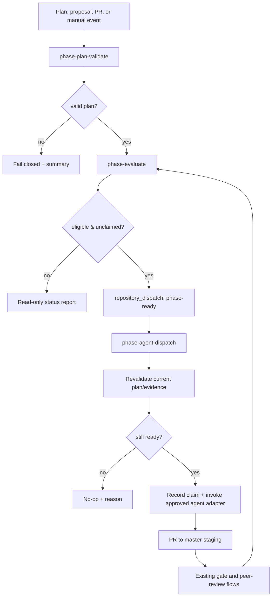

# Agentic Dependency-Phase Flow Design

**Status:** Implementation design only. This document specifies a safe first control plane; it does not add a workflow, dispatch an agent, or change repository governance.
**Canonical companion documents:** [`template-candidates.yaml`](template-candidates.yaml), [`TEMPLATE_CAPABILITY_ASSESSMENT.md`](TEMPLATE_CAPABILITY_ASSESSMENT.md), and [`deepwiki-validation.yaml`](deepwiki-validation.yaml).

## Purpose and authority boundary

The control plane should schedule **repository work phases**, not Gantt rows. A phase is a stable, version-controlled work unit with explicit prerequisites, item/proposal links, required checks, human approval status, and objective completion evidence. A terminal Gantt, JSON projection, DeepWiki page, dashboard card, model output, or agent comment is never authority for dispatch or completion.

> **Authoritative evidence is deliberately narrow:** the approved dependency plan, proposal/item records, branch/PR state, named required checks, and explicit human approval evidence. Every other artifact is advisory or presentational.

The approach applies the selected seeds in complementary roles. ICM supplies compact contracts and human-editable state boundaries; Content-Agent-Routing supplies minimal task context envelopes; Camshaft may later analyze a derived plan but does not make execution decisions; Ganttless and Gantt views can render results; and CCTV/GanTTY-like interfaces remain local optional views.[1] [2] [3]

## Canonical contract

The initial source of truth is `docs/agentic/dependency-phases.yaml`. It must use stable strings rather than mutable positional IDs. Its schema is intentionally small:

```yaml
schema_version: 1
plan_id: dependency-phases
base_branch: master-staging

phases:
  - phase_id: DPH-00
    title: Foundation and validator
    proposal: gantt-dependency-phases
    items: [DPH-00-01]
    depends_on: []
    required_gates: [repo-gate, termux-smoke]
    approval: { required: false }
    execution: { agent: jules, mode: agent_or_human }
    completion:
      require_merged_pr: true
      require_all_items_terminal: true

  - phase_id: DPH-10
    title: Read-only evaluator
    proposal: gantt-dependency-phases
    items: [DPH-10-01]
    depends_on: [DPH-00]
    required_gates: [repo-gate, termux-smoke]
    approval: { required: true }
    execution: { agent: jules, mode: agent }
    completion:
      require_merged_pr: true
      require_all_items_terminal: true
```

The validator will reject duplicate phase IDs, duplicate controlled item ownership, unknown gates, unknown dependency IDs, self-dependency, cycles, unsupported execution modes, and an empty completion rule. It will produce a topological ordering and an evaluation report without editing the source plan.

## Derived phase state

| State | Deterministic definition | Allowed action |
|---|---|---|
| `invalid` | Schema, identity, gate, or cycle validation failed | Fail closed; publish diagnostics only. |
| `waiting` | One or more prerequisites are incomplete | Report only. |
| `blocked` | Prerequisite blocked, approval missing, or conflicting claim/PR exists | Report the precise evidence; do not dispatch. |
| `ready` | Dependencies complete, gates/evidence valid, approval present where required, no active claim | Create one idempotent phase-ready event. |
| `running` | Valid phase claim or linked open PR exists | Observe only; no duplicate agent. |
| `awaiting_review` | Linked PR exists but required review/check evidence is incomplete | Use existing review/ops flows; no new implementation agent. |
| `complete` | Required merged PR, check evidence, and item terminal state all agree | Unlock downstream evaluation; do not automatically close/publish/push. |

## Workflow topology



### Workflow responsibilities

| Component | Trigger | Read/write boundary | Job permissions |
|---|---|---|---|
| `phase-plan-validate.yml` | `pull_request` paths for phase plan/schema/tests; manual dispatch | Parse fixtures and plan. Never writes GitHub state. | `contents: read` |
| `phase-evaluate.yml` | Trusted push to `master-staging`; `repository_dispatch`; manual dispatch; low-frequency schedule | Reads plan, PRs, checks, proposal/item evidence; writes only a run summary in v1. | `contents: read`, `pull-requests: read`, `issues: read`, `checks: read`, `statuses: read` |
| `phase-agent-dispatch.yml` | `repository_dispatch` type `phase-ready`; manual recovery dispatch | Re-reads current state, records a claim only if still eligible, invokes approved launch adapter. | `contents: read`, `issues: write`, `pull-requests: read` |
| `phase-status-report.yml` | Manual dispatch; at most a bounded daily/low-frequency schedule | Emits human-readable matrix and stale-evidence diagnostics. | Read-only permissions |
| `scripts/agentic/validate_dependency_phases.py` | Called by validation/evaluation workflows | Pure parsing, validation, topological ordering, and output serialization. | No token |

The first release should not assign labels, create issues, or write status comments from the evaluator. A short run summary is sufficient. Writes enter only in the separately controlled dispatch job where a claim is needed to prevent duplicate work.

## Event contract and idempotency

GitHub Actions workflow-token events do not generally cause further workflow runs. GitHub documents explicit exceptions for `workflow_dispatch` and `repository_dispatch`; the design therefore uses an explicit `repository_dispatch` event rather than assuming a bot-applied label will start the downstream flow.[4]

```json
{
  "event_type": "phase-ready",
  "client_payload": {
    "plan_id": "dependency-phases",
    "phase_id": "DPH-10",
    "plan_sha256": "<full canonical plan digest>",
    "base_ref": "master-staging",
    "proposal": "gantt-dependency-phases",
    "items": ["DPH-10-01"],
    "trigger_sha": "<source commit>",
    "idempotency_key": "DPH-10:<plan_sha256>:master-staging"
  }
}
```

The dispatch workflow must ignore its payload as an authority claim and independently evaluate the current plan and current GitHub evidence. A phase claim contains the phase ID, exact plan hash, event/run URL, target branch, and a timestamp. A claim with the same idempotency key is a no-op. A changed plan hash intentionally produces a new decision; it must still be reviewed before any new dispatch.

| Failure or replay case | Required response |
|---|---|
| Duplicate event / same idempotency key | No-op; record existing claim/run. |
| Plan changed after event creation | Revalidate; dispatch only if the new plan still makes the phase ready. |
| Active PR or claim already exists | Mark `running` or `blocked`; no parallel implementation launch. |
| Required check fails | Mark `awaiting_review` or `blocked`; no retry agent launched automatically. |
| Agent fails before a PR exists | Report stale claim; require manual recovery/explicit new event. |
| New human approval absent | Keep `blocked`, even if all technical prerequisites pass. |

## Agent launch envelope

The agent prompt should be generated from the current canonical sources, not hand-authored in a comment. It must include only the phase ID, goal, item IDs, plan hash, base branch, relevant repository contracts, open-PR file claims, and completion evidence required. It should reuse the repository’s existing `master-staging` and claim conventions from the Jules issue workflow rather than create a second coordination protocol.[5]

```markdown
Phase: DPH-10 — Read-only evaluator
Plan hash: <sha256>
Base branch: master-staging
Implements: DPH-10-01

Read: AGENTS.md, docs/proposals/registry.yaml, the current phase plan,
and only the task-relevant contracts.

Constraints:
- Do not change files already claimed by an open related agent PR.
- Make the smallest reviewable diff.
- Do not add secrets, runtime credentials, or generated large artifacts.
- Do not merge, close a proposal, or advance a submodule Gitlink.
- Open a PR to master-staging and include the phase/item IDs.

Completion evidence:
- The specified validation fixture and required gates are green.
- The PR contains a structured claim with changed file paths.
```

## Concurrency, trust, and secrets

Evaluation runs use a per-plan concurrency key and should retain queued completion evidence rather than cancelling all preceding evaluations. GitHub Actions concurrency otherwise limits a group to one running and typically one pending run; explicit design is needed to avoid losing meaningful phase transitions.[6]

```yaml
concurrency:
  group: dependency-phases-${{ github.repository }}-${{ inputs.plan_id || 'default' }}
  cancel-in-progress: false
  queue: max
```

The exact availability of queued concurrency should be tested in the repository before it is made a required behavior. If unavailable, the evaluator must remain idempotent and be safe to run manually.

The plan validation workflow runs on normal `pull_request` with read-only access. No phase workflow should check out untrusted fork code in a privileged `pull_request_target` or `workflow_run` job. GitHub’s security reference warns that privileged triggers combined with untrusted checkout can compromise repositories; it also recommends least-privilege tokens and immutable action pinning.[7] The existing repository convention of root `permissions: {}` plus per-job elevation should be preserved.[8]

| Boundary | Required rule |
|---|---|
| Pull requests from forks | Validation only; no write permissions, secrets, agent launch, or privileged checkout. |
| Workflow actions | Pin third-party actions to reviewed full commit SHAs where feasible. |
| Agent token | Give only the launch job the narrow write permission it needs; never expose it to plan parsing. |
| Human approval | Store as protected review/evidence; never infer it from agent prose. |
| Merges and proposal lifecycle | Remain human-controlled under existing repository process. |
| Submodules | No automatic add/update/init in phase workflows. |

## Candidate integration boundaries

| Selected seed | Approved contribution | Forbidden responsibility |
|---|---|---|
| Camshaft | Optional offline/advisory analyzer for a derived plan, after reproducible build provenance exists | Source of truth, automatic dispatch, completion determination |
| ICM Architect / Methodology | Contract structure, stage names, canonical-file discipline, human gate pattern | Evidence substitution through file presence alone |
| Content-Agent-Routing | Minimal context envelope and canonical-source routing | Copying all workflow state into prompts/comments |
| gantt-cli / Ganttless | Later JSON/Mermaid/ASCII projection patterns | Stable external identity or eligibility inference |
| ICM CCTV / GanTTY | Local optional status/checkpoint interaction inspiration | CI dependency or remote control plane |

## Acceptance test matrix

| Test ID | Input / condition | Expected result |
|---|---|---|
| P1 | Valid linear graph | Topological order and correct `ready` initial phase. |
| P2 | Fan-in graph | Downstream phase stays `waiting` until every prerequisite is complete. |
| P3 | Unknown dependency | Validation fails closed with exact phase and dependency ID. |
| P4 | Cycle or self-dependency | Validation fails closed; no dispatch event. |
| P5 | Duplicate phase/item ownership | Validation fails unless explicit shared ownership policy is present. |
| P6 | Approval-required but unapproved phase | State is `blocked`; no agent launch. |
| P7 | Replay of same `phase-ready` event | Exactly one claim/agent invocation. |
| P8 | Plan altered after dispatch payload creation | Dispatcher re-evaluates current plan and no-ops if conditions changed. |
| P9 | Related open agent PR exists | State is `running` or `blocked`; no competing launch. |
| P10 | Required check fails | `awaiting_review`/`blocked`; no automatic retry. |
| P11 | Objective completion evidence present | Dependents become evaluable; no automatic merge/closure occurs. |
| P12 | Gantt projection generated | Output is deterministic and does not mutate canonical YAML. |

## Rollout sequence

The rollout should proceed through small PRs against `master-staging`: (1) schema and pure validator; (2) read-only evaluator/report; (3) controlled idempotent dispatch; (4) bounded reconciliation; and (5) optional projections. Each PR carries its phase/item reference, passes `git diff --check`, repository gate, Termux smoke gate, and the smallest relevant fixture suite. No fork/submodule update belongs in the first four PRs.

## References

[1]: https://github.com/timerloggedout-spec/Camshaft_fork/blob/main/src/commands/bulk.rs "Camshaft bulk import validation"
[2]: https://github.com/timerloggedout-spec/icm-architect_fork/blob/main/SKILL.md "ICM Architect stage-contract guidance"
[3]: https://github.com/timerloggedout-spec/content-agent-routing-promptbase_fork/blob/main/README.md "Content-Agent-Routing layers and dependency rules"
[4]: https://docs.github.com/en/actions/how-tos/write-workflows/choose-when-workflows-run/trigger-a-workflow "GitHub Actions workflow-triggering behavior"
[5]: https://github.com/timerloggedout-spec/termux-monorepo/blob/master/.github/workflows/agent-jules-on-issues.yml "Existing Jules agent coordination workflow"
[6]: https://docs.github.com/en/actions/how-tos/write-workflows/choose-when-workflows-run/control-workflow-concurrency "GitHub Actions concurrency controls"
[7]: https://docs.github.com/en/actions/reference/security/secure-use "GitHub Actions secure-use guidance"
[8]: https://github.com/timerloggedout-spec/termux-monorepo/blob/master/.github/workflows/agent-continuous-ops.yml "Existing least-privilege workflow convention"
