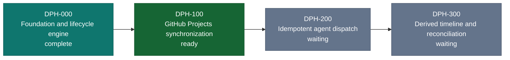

# Dependency Phase Status

This file is generated from `docs/agentic/dependency-phases.json` and a normalized evidence snapshot.
Do not edit it as an authority source.

**Plan hash:** `3d564bcdc6845bff249030ad73eb57ab6901d0a7c01e96a12ccde5f514ecd4b7`

| Phase | State | GitHub Project status | Linked PRs | Reason |
|---|---|---|---|---|
| `DPH-000` | **complete** | Done | #900 | merged PR, required checks, and project status agree |
| `DPH-100` | **ready** | Todo | — | all prerequisites and current evidence permit a claim |
| `DPH-200` | **waiting** | unmapped | — | waiting on DPH-100 |
| `DPH-300` | **waiting** | unmapped | — | waiting on DPH-200 |

## Safety boundary

The chart and report are derived views. Phase completion requires a matching merged PR, the configured checks, and a GitHub Project item in `Done`; agent comments, rendered diagrams, and inferred approvals do not satisfy those conditions.
