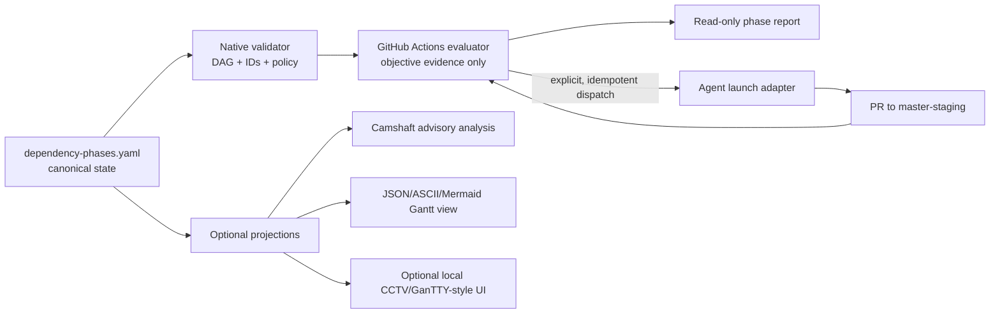

# Template Capability Assessment and Seed Selection

**Author:** Manus AI
**Assessment date:** 2026-08-18
**Status:** Source-reviewed portfolio assessment. No candidate has been adopted, added as a submodule, invoked by a workflow, or modified.
**Scope:** Six user-owned Gantt/agentic seeds discovered from the account’s owned/starred Gantt matches, plus the four active `refTemplates/smods` reference forks.

## Executive summary

This portfolio contains **three complementary capability layers**, not one interchangeable collection of Gantt tools. First, **Camshaft** is the strongest machine-oriented planning seed: it accepts YAML/JSON plans, validates task references, supports dependency types and resources, emits structured output, and has CLI tests for dependency and optimisation flows.[1] Second, **ICM Architect**, **Interpretable Context Methodology**, and **Content-Agent-Routing Promptbase** provide the governance architecture that should surround any agentic phase graph: canonical files, explicit contracts, one-way dependencies, selective context routing, human gates, and filesystem-visible state.[2] [3] [4] Third, **Ganttless**, **GanTTY**, and `gantt-cli_fork_agentic` supply different presentation or interaction patterns, but none should become the authoritative execution state.

The recommended initial seed set is therefore **Camshaft as an optional advisory adapter**, plus the existing ICM/routing fork set as the policy inspiration for repository-native contracts. The concrete canonical artifact should remain a small version-controlled YAML phase plan inside `termux-monorepo`. The proposed actions evaluator determines eligibility from that plan, PR/check evidence, and explicit approvals. A Gantt or terminal tool may render the result, but it cannot authorize work, merge a pull request, or promote a proposal.

> **Selection decision:** Start with a native YAML schema and deterministic validator. Extract patterns from Camshaft, ICM, and context routing. Defer direct runtime/submodule adoption of every Gantt seed until the core contract has fixture coverage and a demonstrated need for a renderer or optimizer.

## Assessment method

Candidates were assessed from cloned source, GitHub repository metadata, documented interfaces, test code, and workflow records. Claims from a README were treated as intent until corroborated by implementation or tests. Direct DeepWiki access was attempted and the page stated that `termux-monorepo` is **not indexed**, so it supplied no usable code-analysis claims. A branch named `feature/deepwiki-github-wiki-mirror` was reviewed separately; it provides historical GitHub Wiki publication context, not a substitute for an indexed DeepWiki repository.[5] [6]

| Evidence status | Meaning | Count |
|---|---|---:|
| **Source-reviewed** | Direct source and metadata inspected; no runtime adoption decision implied. | 10 |
| **Runtime-validated** | Reproduced test or command execution on the reviewed revision. | 0 |
| **DeepWiki-correlated** | A live DeepWiki claim compared with source. | 0 |
| **DeepWiki unavailable** | Page reachable but repository not indexed; no technical claim available. | 1 repository |

The sandbox does not provide Cargo, so Rust test suites were not executed locally. Camshaft’s visible recent GitHub failures were Dependabot failures caused by an unavailable `../GanttML` path dependency; they are not evidence of passing or failing application tests. This is a portability and validation gap, not a quality verdict.[7]

## Capability map

| Candidate | Core capability | Machine-readable I/O | Dependency intelligence | Automation fit | Key limitation | Disposition |
|---|---|---|---|---|---|---|
| **Camshaft** | Agent-oriented CPM/critical-chain planning | YAML/JSON bulk import and JSON output | Tasks, typed dependencies, milestones, resources, assignments, critical path, parallel groups | High after dependency resolution is made portable | Local path dependency on `GanttML`; no current isolated build proof | **Adapter candidate** |
| **ICM Architect** | Stage/workspace design | Markdown contracts and folders | Ordered stages, explicit handoffs, human checks | High as a design policy | Methodology, not a scheduler | **Pinned customization / policy seed** |
| **ICM Methodology** | File-backed workflow state | Markdown and folder contracts | One-way references, canonical sources, stage inputs/outputs | High as a design policy | Sequential/human-reviewed focus; not high-concurrency orchestration | **Pinned customization / policy seed** |
| **Content-Agent-Routing** | Selective context routing | Layered Markdown routing files | One-way dependency and canonical-source patterns | High for prompts and task envelopes | Content-operation origin; requires domain adaptation | **Pinned customization / policy seed** |
| **gantt-cli** | Interactive, JSON-backed terminal planner | JSON persistence | Parent/child tasks and recalculated scheduling | Medium as an exporter target | Reordering remaps numeric IDs/dependencies | **Pattern extraction** |
| **Ganttless** | ASCII time-range rendering | YAML or CLI input; string output | None | High only as a deterministic output formatter | No graph, identity, persistence, or validation model | **Pattern extraction** |
| **GanTTY** | Interactive terminal dependency editing | Local pickle persistence | Direct dependency selection and criticality state | Low | GPL-3.0, pickle state, terminal event loop | **Reference only** |
| **Gantt-Chart-Code** | Flat feature records to nested hierarchy | Parsed records to serializable tree | Parent/child only | Medium as an ingestion-pattern reference | No dependency scheduling or production CLI output contract | **Pattern extraction** |
| **Montt** | Probabilistic critical-path seed | Custom DSL | Critical path plus estimate/Q95 concept | Low initially | Forecast path has an explicit stub; not YAML-native | **Defer** |
| **ICM CCTV** | Optional visual file board | Markdown card and response files | Mirrors pipeline/checkpoint state | Medium as a later local UI | Local Node/WebSocket renderer; not a control plane | **Reference only** |

### Scoring rubric

Scores below use a 0–5 scale and are directional, not claims of production readiness. Higher integration friction or risk reduces the weighted total. The purpose is a transparent shortlist, not pseudo-precision.

| Candidate | Functional uniqueness | Phase-graph fit | Machine I/O | Automation fit | Termux fit | Test/provenance confidence | Weighted signal / 30 |
|---|---:|---:|---:|---:|---:|---:|---:|
| Camshaft | 5 | 5 | 5 | 5 | 3 | 2 | **25** |
| Content-Agent-Routing | 4 | 4 | 5 | 4 | 5 | 4 | **26** |
| ICM Architect | 4 | 4 | 4 | 4 | 5 | 3 | **24** |
| ICM Methodology | 4 | 4 | 5 | 4 | 5 | 3 | **25** |
| gantt-cli | 4 | 3 | 4 | 3 | 4 | 2 | **20** |
| Ganttless | 2 | 1 | 4 | 4 | 5 | 2 | **18** |
| GanTTY | 3 | 3 | 1 | 1 | 4 | 1 | **13** |
| Gantt-Chart-Code | 3 | 2 | 3 | 3 | 4 | 2 | **17** |
| Montt | 3 | 3 | 2 | 2 | 4 | 1 | **15** |
| ICM CCTV | 3 | 2 | 4 | 2 | 2 | 3 | **16** |

## Candidate findings and selection decisions

### CAMSHAFT — select as an advisory adapter candidate

Camshaft is the only assessed Gantt seed whose source already resembles an agent-facing planning interface. Its documented `bulk-import` path accepts a complete YAML or JSON plan, and the implementation validates relative paths, file size, duplicate IDs, invalid task references, dependency types, resource references, and assignments before performing one final save.[1] The test suite directly exercises task addition, dependency creation, invalid references, validation, critical-path querying, and parallel group output.[8]

The valuable pattern is **atomic validation-first plan ingestion**, not external scheduling authority. Its `gantt_ml` dependency is currently declared as `path = "../GanttML"`, which prevents an isolated build from the fork alone and broke recent Dependabot resolution.[7] The first adaptation should therefore be a native Python/YAML validator and a small optional Camshaft compatibility adapter only after the upstream dependency can be pinned/reproducibly built.

| Adopt now | Do not adopt | Required evidence before a runtime trial |
|---|---|---|
| Stable string IDs; YAML/JSON plan import; typed dependency vocabulary; critical-path/parallelism as advisory data | Any automatic dispatch, mutation, completion determination, or unpinned local-path dependency | Reproducible `GanttML` provenance, isolated build, pinned revision, license review, and fixture parity test |

### ICM ARCHITECT + ICM METHODOLOGY — select as the contract-and-governance seed

ICM Architect formalizes the parts of the proposed flow that should be durable: one folder/contract per job, compact routing files, ordered stages, explicit input/process/output contracts, separate factory and run artifacts, and human-editable handoffs.[2] The broader methodology reinforces that files can expose state, canonical sources should not drift, and one-way references prevent circular maintenance growth.[3]

These concepts align directly with a repository-native dependency phase plan. The plan itself can be treated as an ICM contract; the evaluator can write derived reports without overwriting it; and human approvals can exist as explicit evidence files or protected review events. The existing monorepo already uses these forks as shallow, pinned reference inputs, so no new submodule structure is proposed.

| Adopt now | Do not adopt | Required implementation guardrail |
|---|---|---|
| Explicit contracts, canonical files, one-way dependencies, human gates, small stages | Folder presence as proof that code or a PR is complete | Completion must still require objective PR/check/item evidence |

### CONTENT-AGENT-ROUTING — select as the agent-envelope seed

The promptbase supplies a complementary discipline: a stable `CLAUDE.md` or `AGENTS.md` routes work, a `CONTEXT.md` selects the workspace, and task-local contracts load only the files and sections needed for the job.[4] Its explicit canonical-source and one-way-dependency rules translate well to phase dispatch prompts: a phase payload should identify the authoritative plan, item IDs, required evidence, and relevant files without copying the entire state graph into every agent prompt.

| Adopt now | Do not adopt | Required implementation guardrail |
|---|---|---|
| Scoped phase prompt, file-claim inventory, canonical source links, minimal context envelopes | Large monolithic prompts or copied state in issue comments | Prompt content must be regenerated from the current plan hash and evidence, not cached as authority |

### GANTT-CLI + GANTTLESS — retain as a derived-rendering seed

`gantt-cli_fork_agentic` persists JSON task data, models dependencies and parent task relationships, calculates dependency-constrained dates, and reports unschedulable cycle symptoms.[9] However, it renumbers IDs and dependency references after task reorder operations. That makes its task IDs unsafe as long-lived GitHub/issue/phase keys. It is a useful exporter-target or UI prototype, not a source of truth.

Ganttless has an even narrower but useful role: it deterministically renders flattened day or number ranges from YAML or CLI input into compact ASCII text. Its core implementation has no dependency graph, persistence, or state transitions.[10] It is a good future action-summary formatter once a validated evaluator supplies start/end dates.

| Candidate | Extractable pattern | Explicit no-go |
|---|---|---|
| gantt-cli | Parent roll-up, JSON projection, schedule presentation | Numeric IDs as canonical phase identities; TUI-driven mutation in CI |
| Ganttless | Compact ASCII status/timeline output | Inference of prerequisites or eligibility from rendered ranges |

### GANTTY, GANTT-CHART-CODE, MONTT, AND ICM CCTV — retain, but do not promote

GanTTY’s direct dependency-selection and criticality UI are legitimate inspiration for a local terminal interface, but its pickle persistence and interactive event loop are unsuitable for a repository workflow authority.[11] Gantt-Chart-Code demonstrates rebuilding a nested program/feature tree from flat records; that is a useful ingestion pattern, but not a dependency scheduler.[12] Montt introduces estimate/Q95 and critical-path ideas, but uses a custom DSL and contains a forecast sampler stub returning `0.0`; it should not influence initial risk calculations.[13] ICM CCTV correctly defines itself as an optional, file-backed visual layer whose renderer watches agent-written artifacts; this is a later status-board candidate, not an Actions control plane.[14]

## Recommended architecture boundary

The selected capabilities compose into a clear boundary:

**The left side is authoritative; the right side is advisory or presentational.** The workflow never reads a Gantt image, terminal state file, agent comment, or DeepWiki description to decide whether a phase is ready. It derives readiness from the reviewed YAML plan, proposal/item state, branch/PR data, required check results, and explicit human approval evidence.

## Safe initial backlog

| Order | Deliverable | Seed influence | Explicitly out of scope |
|---:|---|---|---|
| 1 | `dependency-phases.yaml` schema and fixtures | ICM contracts; Camshaft typed dependencies | UI, submodule changes, agent launch |
| 2 | Pure validator/topological evaluator | Camshaft import validation; Ganttless deterministic output principle | External optimizer dependency |
| 3 | Read-only Actions phase report | ICM observability; context routing | Writes, labels, agent invocations |
| 4 | Idempotent dispatch adapter | Context routing + existing Jules coordination | Automatic merge/close/promote |
| 5 | Optional plan projection | Ganttless, gantt-cli, historical `gantt_core.py` | Renderer as authority |
| 6 | Optional local visual checkpoint board | ICM CCTV and GanTTY interaction patterns | Network-exposed dashboard or GitHub Actions dependency |

## DeepWiki and Devin conclusion

The direct DeepWiki page has not indexed `termux-monorepo`, so it is currently **not an assessment data source**. The historical deepwiki-named branch is useful evidence that the repository has considered wiki publication and contains a simple file-backed Gantt projection, but it does not certify any candidate capability. No Devin indexing or delegated research was initiated; direct source evidence was sufficient for this assessment, and an index request would be an external action rather than a passive read.

The full reconciliation ledger is in [`deepwiki-validation.yaml`](deepwiki-validation.yaml). The candidate-level source and disposition record is in [`template-candidates.yaml`](template-candidates.yaml).

## References

[1]: https://github.com/timerloggedout-spec/Camshaft_fork/blob/main/README.md "Camshaft fork README"
[2]: https://github.com/timerloggedout-spec/icm-architect_fork/blob/main/SKILL.md "ICM Architect skill"
[3]: https://github.com/timerloggedout-spec/interpretable-context-methodology_fork/blob/main/README.md "Interpretable Context Methodology"
[4]: https://github.com/timerloggedout-spec/content-agent-routing-promptbase_fork/blob/main/README.md "Content-Agent-Routing Promptbase"
[5]: https://deepwiki.com/timerloggedout-spec/termux-monorepo "Direct DeepWiki page"
[6]: https://github.com/timerloggedout-spec/termux-monorepo/blob/master/.github/workflows/publish-wiki.yml "GitHub Wiki publication workflow"
[7]: https://github.com/timerloggedout-spec/Camshaft_fork/blob/main/Cargo.toml "Camshaft dependency declaration"
[8]: https://github.com/timerloggedout-spec/Camshaft_fork/blob/main/tests/cli_tests.rs "Camshaft CLI tests"
[9]: https://github.com/timerloggedout-spec/gantt-cli_fork_agentic/blob/main/src/main.rs "gantt-cli fork scheduling implementation"
[10]: https://github.com/timerloggedout-spec/ganttless_fork-agentic/blob/main/src/ganttless.rs "ganttless rendering implementation"
[11]: https://github.com/timerloggedout-spec/GanTTY_fork/blob/master/gantt.py "GanTTY dependency model"
[12]: https://github.com/timerloggedout-spec/Gantt-Chart-Code_fork/blob/main/program_ingester/src/output.rs "Gantt-Chart-Code hierarchy transformation"
[13]: https://github.com/timerloggedout-spec/montt_fork/blob/main/src/montt.rs "Montt critical-path and forecast implementation"
[14]: https://github.com/timerloggedout-spec/icm-cctv_fork/blob/main/README.md "ICM CCTV optional visual layer"
