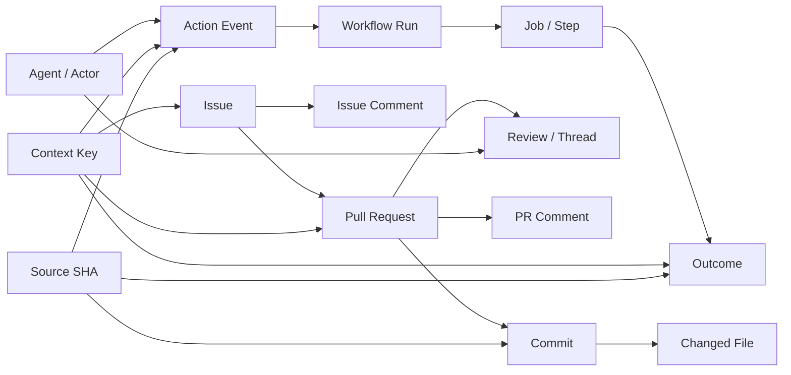

# Context Relationship Index

## Purpose

This is the durable map for **prompt/context-ingestion efficiency** and cross-time reasoning over GitHub development activity.

The repository already contains a reusable relationship-graph method. The governed Linguist workstream records both a generated bounded PR graph and a curated verified/candidate relationship summary, including `context-pr177.mmd`, `linguist-relationship-summary.mmd`, and `context-relationship-graph-reuse.md`. That work is evidence that graph generation is useful; it is not evidence that every inferred edge is true.

## Graph model

## Edge confidence

Every relationship is one of:

- `verified` — directly supported by GitHub metadata or an immutable artifact
- `derived` — deterministic correlation from verified facts
- `inferred` — plausible attribution/relationship requiring uncertainty
- `candidate` — discovered for review but not yet validated

Never silently promote an inferred edge to verified.

## Prompt-ingestion efficiency

Before dispatching an agent, the Manager should collect the smallest sufficient context set:

`task → related issues/PRs → relevant commits → changed files → reviews/comments → latest verification`

Prefer **context reuse** over repeated full-history ingestion. The graph should expose:

- context already seen by an agent
- new context since the previous attempt
- contradictory findings
- stale context
- duplicated prompts/work
- relevant historical fixes
- unresolved review threads
- provider/model observations relevant to the same task family

### Context delta

For attempt `n`:

`context_delta(n) = context(n) - context(n-1)`

The manager should preferentially send the delta plus a compact stable summary rather than retransmitting unchanged history.

## Variation justifications

Every MVT variation should declare **why the context differs**:

- prompt wording
- context ordering
- historical depth
- reviewer role
- adversarial challenge
- code-only vs code+discussion
- prior findings included/excluded
- provider/model-specific instruction

A variation without a justification is experimental noise.

## Time traversal

The graph must support two directions:

- **forward:** lead signal → dispatch → implementation → verification → outcome
- **backward:** failure/regression → preceding context → decision → agent/model → source event

This makes it possible to ask both:

> What led to this result?

and:

> What did this result teach the next iteration?

## Decision matrix / Mermaid history

The earlier relationship-graph implementation is maintained as a **method and case-study pattern**, not as a one-off image. Issue #274 explicitly identifies the generated PR #177 graph, curated verified/candidate graph, and reusable graph-method case study. The Mermaid sources are therefore valuable because they can be diffed, regenerated, traversed, and modified over time; raster images are presentation artifacts.

The graph system should therefore prefer:

`source data → Mermaid / machine-readable graph → rendered image`

rather than:

`image → guessed structure`.

## Ownership

- **Manager/Conductor:** decides what context is required and why.
- **Context Indexer:** discovers and normalizes relationships.
- **Provider Router:** selects execution candidates.
- **Agent workers:** consume bounded context and produce findings.
- **Audit/Lead-Lag monitor:** records temporal evidence and outcomes.
- **Human:** resolves ambiguous/high-impact relationship or authority decisions.

The graph is a shared evidence substrate, not an autonomous authority to merge code.

## SSOT discipline

Git SHA, GitHub event/run IDs, and immutable artifact identifiers are the anchors. Generated graphs and summaries are projections. When a projection disagrees with source evidence, regenerate it; do not edit the projection to conceal the discrepancy.
