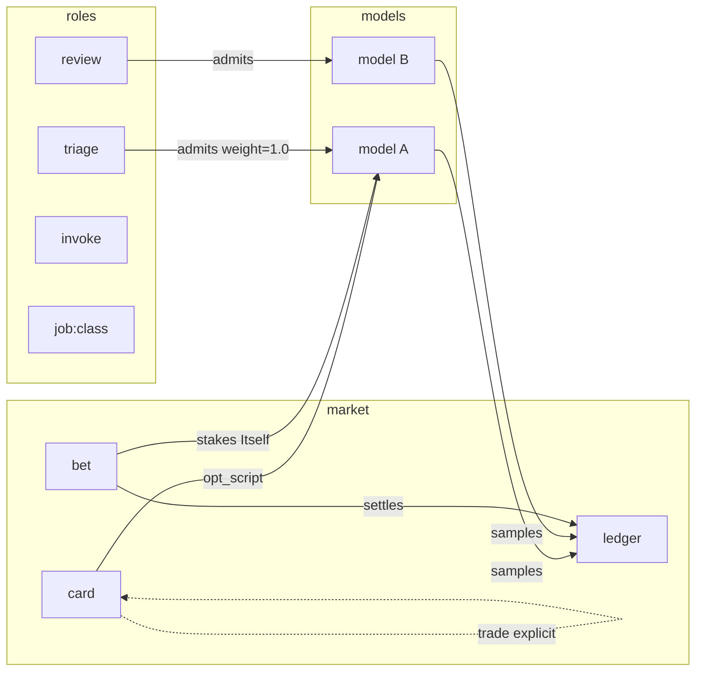

# GRAPH (MSM-005 design)

## Total graph

Nodes:

- **Role** — triage | review | invoke | job:\<id\> | engine:\<id\>
- **Model** — free-eligible model_id
- **Card** — trading card (code + meta + optional opt_script)
- **Bet** — ledger entry (Itself | Others | Job)
- **Job** — lane/job class (help-wanted, dual-gate, review, …)

Edges:

- `admits` — role → model (equal-weight bootstrap)
- `samples` — model → ledger sample
- `owns` — owner → card
- `trades` — card → card (explicit share only)
- `stakes` — actor → bet → subject
- `settles` — bet → outcome → sample

## Trading cards

Schema: `schemas/trading-card.schema.json`

- Negotiable share via `share` + `trade_log` only
- No secrets
- Per-role; no silent weight table copy across roles

## Bets

Schema: `schemas/bet-ledger.schema.json`

| Actor | Meaning |
|-------|--------|
| Itself | model/engine card stakes own next outcome |
| Others | peer card |
| Job | lane/job class outcome |

Observational until two observe cycles + #192-class decision. Free-only. Settlement does **not** bypass dual-gate.

## Ops surface (future)

- Read-only graph export under `docs/ops/generated/` (observatory pattern)
- No Class 3/4 artifacts
